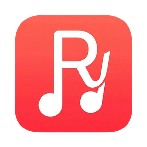

  

<h1 align="center">RayMusic</h1>

  <b>Redefining the YouTube Music Experience on Android.</b> 
  <i>It's high-performance, privacy-focused, and packed with features for people who really care about their experience.</i>

  <a href="#funcionalidades-principales">Features</a> •
  <a href="#capturas-de-pantalla">Screenshots</a> •
  <a href="https://t.me/RayMusicFree">Support Telegram</a> •
  <a href="https://x.com/XaviGsm15">Twitter (X)</a>

  
  
  

  
  
  
  

  
  

---

## Resumen de la Aplicación

**RayMusic** no es solo otro cliente genérico de YouTube Music para Android. Es un reproductor personalizado desarrollado desde cero para los entusiastas de la música que valoran la privacidad, el rendimiento extremo y una estética visual impresionante.

La aplicación destaca por su revolucionaria interfaz **Liquid Glass** (cristal líquido). Este motor visual dinámico procesa las portadas de los álbumes en tiempo real para generar desenfoques inmersivos, reflejos estirados en 1D y degradados translúcidos fluidos que tiñen toda la interfaz. De este modo, la aplicación se funde cromáticamente con el tema de la canción en reproducción, creando una atmósfera verdaderamente premium, limpia y carente de elementos oscuros innecesarios.

Con RayMusic, tus datos permanecen privados: la aplicación no realiza telemetría, prescinde de rastreadores y ofrece un inicio instantáneo al cargar en caché las sugerencias de la pantalla principal en segundo plano, eliminando molestas pantallas de carga y haciendo que toda la navegación se sienta inmediata y fluida.

---

## Capturas de Pantalla

Disfruta de un vistazo a la cuidada y premium interfaz de usuario:

  
  
  

  
  
  

  

---

## Funcionalidades Principales

RayMusic te otorga un control absoluto y una experiencia inmersiva sin igual:

*   **Efecto Liquid Glass Total:** Las barras de navegación, botones y mini-reproductores adquieren colores vibrantes y translúcidos que nacen orgánicamente de la portada musical actual.
*   **Reflejo Estirado 1D Premium:** Tanto el reproductor principal como las tarjetas de sugerencias destacadas proyectan un estiramiento de píxeles vertical en su borde inferior, fusionándose de manera natural con el fondo sin cortes abruptos ni sombras artificiales oscuras.
*   **Inicio Instantáneo con Caché Inteligente:** La aplicación guarda tu estado de reproducción, última pestaña seleccionada y sugerencias en memoria persistente. Al abrirla, el contenido se muestra de inmediato sin esperas ni pantallas de carga parpadeantes.
*   **Buscador Inteligente de Letras:** Lee las letras sincronizadas en tiempo real directamente desde el reproductor, con la opción de cambiar de proveedor de letras al instante si hay discrepancias.
*   **Identificador de Música por Micrófono (Radio):** Escucha e identifica cualquier pista musical que esté sonando en tu entorno físico para agregarla instantáneamente a tu biblioteca de RayMusic.
*   **Listas de Reproducción y Biblioteca Local:** Administra tus álbumes favoritos, guarda artistas predilectos y crea tus propias playlists cargando portadas personalizadas directamente desde tu galería con recortes geométricos a medida.
*   **Cola de Reproducción y Autoplay Inteligente:** Disfruta de música ininterrumpida basada en algoritmos rápidos que autogeneran recomendaciones y colas de reproducción infinitas adaptadas al historial de escucha reciente.

---

## Detalles Técnicos y Arquitectura

RayMusic está diseñado siguiendo los más altos estándares del desarrollo moderno en Android:

- **Kotlin & Jetpack Compose:** Interfaces declarativas ultrarrápidas, animaciones nativas pulidas a 120 FPS y una gestión reactiva del estado del ciclo de vida de la aplicación.
- **Media3 & ExoPlayer:** Motor de reproducción de audio robusto que soporta reproducción en segundo plano, transiciones suaves, caché inteligente y bajo consumo de batería.
- **Coil Image Loader:** Carga asíncrona de carátulas con optimización de hardware deshabilitada en zonas críticas para permitir el procesamiento en Canvas nativo y la extracción rápida del color dominante.
- **Arquitectura Limpia (MVVM):** Desacoplamiento total entre la lógica del reproductor, el motor de llamadas a la API de YouTube Music (InnerTube), y la capa de presentación Compose, asegurando mantenibilidad y rendimiento óptimo.
- **Zero Tracker Telemetry:** Respeta tu privacidad de principio a fin. Sin analíticas, sin recopilación de datos y sin compartir tu historial de escucha con terceros.
